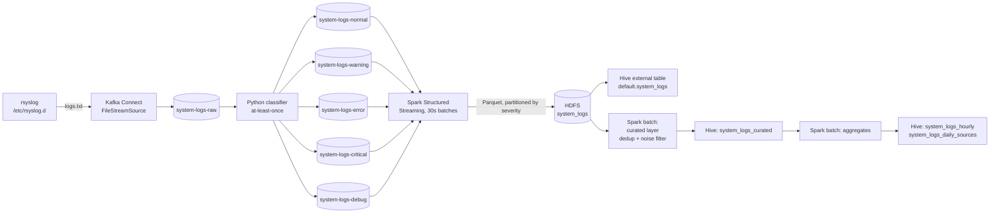

# Streaming System-Log Pipeline (Kafka → Spark → Hive)

A single-node data-engineering project that turns the Linux system log of a VM into queryable,
de-duplicated analytics tables. Logs flow through **rsyslog → Kafka Connect → Kafka → a Python
severity classifier → Spark Structured Streaming → Parquet on HDFS → Hive**, with a curated layer
and hourly/daily aggregates on top.



## What it does
- **Ingests** every line the host writes to syslog (minus the pipeline's own output and auth records).
- **Classifies** each line into one of five severity topics (`normal`, `warning`, `error`, `critical`, `debug`),
  understanding both rsyslog lines and JSON application logs.
- **Lands** the data as Parquet on HDFS, partitioned by severity, and exposes it through Hive.
- **Guarantees** no silent loss: the classifier commits an offset only after the broker acknowledged the
  routed copy (at-least-once), and every routed message carries a key `raw:<partition>:<offset>` so replays can be
  de-duplicated downstream.
- **Curates** the data (drops noise, removes duplicates) and builds hourly and per-source daily aggregates.

## Stack

| Layer | Component | Version |
|---|---|---|
| OS | CentOS Stream 10 (single VM, 7.6 GB RAM) | |
| Messaging | Apache Kafka (KRaft, combined broker/controller) | 4.2.2 |
| Ingestion | Kafka Connect standalone, `FileStreamSource` | 4.2.2 |
| Classifier | Python 3 + `kafka-python` | 3.0.11 |
| Processing | Apache Spark Structured Streaming + batch | 4.2.0 |
| Storage | Hadoop HDFS | 3.4.3 |
| Warehouse | Apache Hive (embedded Derby metastore) + Tez on YARN | 4.2.1 / 0.10.5 |
| Runtime | OpenJDK | 21 |
| Supervision | systemd units + `install.sh` | |

## Repository layout

```
scripts/      classifier, Spark streaming job, curated + aggregate jobs, Hive DDL, validator
systemd/      unit files for the whole stack, install.sh, hadoop-stack.env
config/       Kafka broker, Kafka Connect worker and connector configs
rsyslog/      rsyslog forwarding rule (what goes into the pipeline, and what is excluded)
conf-snapshots/  YARN / Tez / Hive configs that live outside the repo
tests/        unit tests (pytest) and acceptance suites (bash)
docs/         architecture, data model, setup, operations runbook, testing, incident report
```

## Quick start
Full instructions are in [docs/SETUP.md](docs/SETUP.md). In short, on a prepared host:

```bash
sudo /home/hadoop/kafka/systemd/install.sh     # installs units, starts the stack in order
sudo -u hadoop beeline -u jdbc:hive2://localhost:10000 -n hadoop \
  -e "SELECT severity, count(*) FROM default.system_logs GROUP BY severity;"
```

> HiveServer2 must be queried **as user `hadoop`** (`-n hadoop`); as `anonymous` HDFS rejects writes.

## Documentation
| Document | Contents |
|---|---|
| [docs/ARCHITECTURE.md](docs/ARCHITECTURE.md) | components, data flow, delivery guarantees, design decisions |
| [docs/DATA-MODEL.md](docs/DATA-MODEL.md) | topics, message formats, every Hive table and column |
| [docs/SETUP.md](docs/SETUP.md) | prerequisites, installation, verification |
| [docs/OPERATIONS.md](docs/OPERATIONS.md) | start/stop order, health checks, runbooks, known issues |
| [docs/TESTING.md](docs/TESTING.md) | test suites, how to run them, how they were validated |
| [docs/INCIDENT-2026-10-04.md](docs/INCIDENT-2026-10-04.md) | hard reset → HDFS safe mode → recovery, and the fixes |
| [docs/DEPLOYMENT-VERIFICATION.md](docs/DEPLOYMENT-VERIFICATION.md) | systemd install and reboot test, with evidence |

## Status and known limitations
- The whole stack is supervised by systemd and was verified to come back by itself after a clean reboot
  (see [docs/DEPLOYMENT-VERIFICATION.md](docs/DEPLOYMENT-VERIFICATION.md)). Behaviour after a hard power loss has not been re-tested.
- Single node: replication factor 1 everywhere. It demonstrates the architecture, not high availability.
- Memory is tight (about 2.5 GB available with the full stack running).
- The raw table `default.system_logs` is not de-duplicated; use `system_logs_curated` for analytics.
- Older Parquet files predate the `raw_key` column and read it as NULL.
- See [docs/OPERATIONS.md](docs/OPERATIONS.md#known-issues) for the full list.
