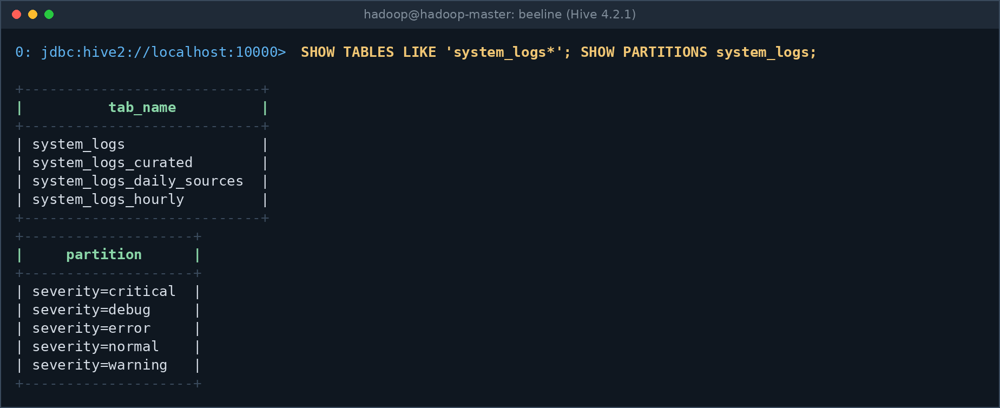
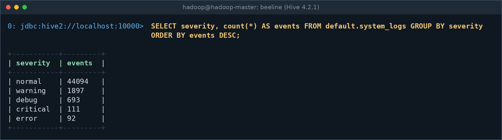
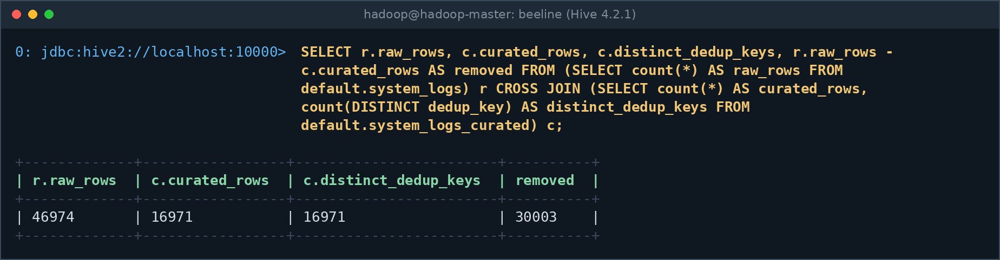
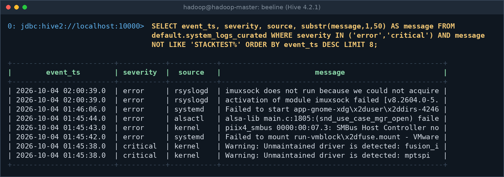
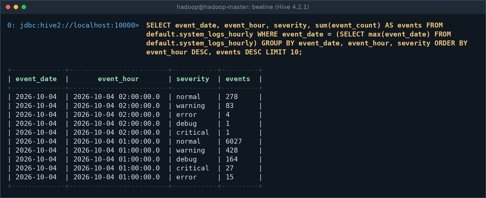
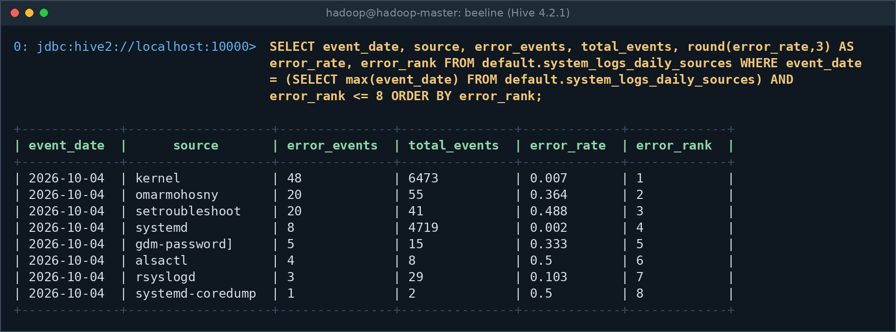

# Data model

## Kafka topics

| Topic | Producer | Content | Key |
|---|---|---|---|
| `system-logs-raw` | Kafka Connect | every log line, wrapped as Connect JSON | none |
| `system-logs-normal` | classifier | syslog `info`/`notice`, JSON level INFO | `raw:<p>:<offset>` |
| `system-logs-warning` | classifier | `warning`/`warn` | same |
| `system-logs-error` | classifier | `err`/`error` | same |
| `system-logs-critical` | classifier | `crit`/`critical`/`alert`/`emerg` | same |
| `system-logs-debug` | classifier | `debug` | same |

Replication factor 1 (single node). The key is the coordinate of the message in `system-logs-raw`.

## Message formats

**Raw value** (Kafka Connect, schemas enabled):
```json
{"schema": {"type": "string", "optional": false}, "payload": "Oct  4 03:17:50 severity=info hostname=hadoop-master program=systemd message=Started session-c120.scope"}
```

**Application JSON log** (also supported, carried in `payload`):
```json
{"timestamp": "2026-10-04T03:17:50Z", "level": "ERROR", "service": "api", "message": "..."}
```

## Hive tables (database `default`)

### `system_logs`: raw landing table (EXTERNAL, partitioned by `severity`)
Not de-duplicated. Location `hdfs://localhost:9000/user/hive/warehouse/system_logs`.

| Column | Type | Meaning |
|---|---|---|
| `event_time` | timestamp | time parsed from the log line (year assumed from Kafka time) |
| `raw_severity` | string | severity as written in the source |
| `hostname`, `program`, `service` | string | origin of the message |
| `message` | string | message text |
| `source_format` | string | `rsyslog`, `app_json` or `unknown` |
| `raw_payload` | string | the unparsed line |
| `kafka_topic`, `kafka_partition`, `kafka_offset`, `kafka_timestamp` | | where the severity-topic copy lives |
| `ingest_time` | timestamp | when Spark processed it |
| `raw_key` | string | `raw:<partition>:<offset>` of the raw-topic message; NULL on files written before the column existed |
| `severity` (partition) | string | `normal`, `warning`, `error`, `critical`, `debug` |

The four pipeline tables and the five severity partitions of `system_logs`. Captured from the live HiveServer2 on `hadoop-master` on 2026-10-05 (beeline as `hadoop`).



Raw volume per severity partition. Routine `info`/`notice` traffic (`normal`) is about 94% of all rows.



### `system_logs_curated`: de-duplicated and noise-free (partitioned by `event_date`, `severity`)
Columns: `event_ts`, `raw_severity`, `hostname`, `program`, `service`, `source`, `message`, `source_format`,
`kafka_topic`, `kafka_partition`, `kafka_offset`, `kafka_timestamp`, `raw_key`, `dedup_key`.
`source` = `program`, else `service`, else `unknown`. `dedup_key` = `raw_key`, else
`kafka:<topic>:<partition>:<offset>`.

De-duplication check. `curated_rows` equals `distinct_dedup_keys`, so no duplicate is left in the curated layer.
The 30,003 removed rows are replays of the same raw message plus the noise programs dropped by
`system_logs_curated.py` (pipeline self-ingestion, `sudo`/`su`/`unix_chkpwd`).



Latest real `error`/`critical` events in the curated layer (test markers excluded). They come from the VM boot at 01:45
(VMware `vmblock` mount, SMBus controller, unmaintained SCSI drivers) and an rsyslog `imuxsock` restart at 02:00.



### `system_logs_hourly` (partitioned by `event_date`)
`event_hour`, `severity`, `source`, `hostname`, `event_count`, `first_seen`, `last_seen`.

Events per hour and severity for the latest day. The 01:00 hour (6,661 events) holds the boot burst; 02:00 is the
partial hour before the last aggregate run.



### `system_logs_daily_sources` (partitioned by `event_date`)
`source`, `total_events`, `error_events` (error + critical), `critical_events`, `warning_events`,
`error_rate` (error_events / total_events), `error_rank` (1 = most errors that day).

Top sources by error count for the latest day. `kernel` has the most errors but a low rate (0.7%), while
`setroubleshoot` and `alsactl` fail on about half of their messages. `omarmohosny` is the end-to-end test
(`logger` tags messages with the user name). `gdm-password]` is the program name exactly as rsyslog reports it
(`program=gdm-password]` in `raw_payload`), not a parsing error.



## Example queries

```sql
-- volume by severity (raw table)
SELECT severity, count(*) FROM default.system_logs GROUP BY severity;

-- worst sources today (aggregates)
SELECT source, error_events, total_events, error_rate
FROM default.system_logs_daily_sources
WHERE event_date = current_date() AND error_rank <= 10
ORDER BY error_rank;

-- trace a row back to Kafka
SELECT raw_key, kafka_topic, kafka_partition, kafka_offset FROM default.system_logs
WHERE raw_key IS NOT NULL LIMIT 5;
```

Register partitions of the curated and aggregate tables after Spark creates new ones:
`MSCK REPAIR TABLE default.system_logs_curated;` (the `.sql` files do this).
